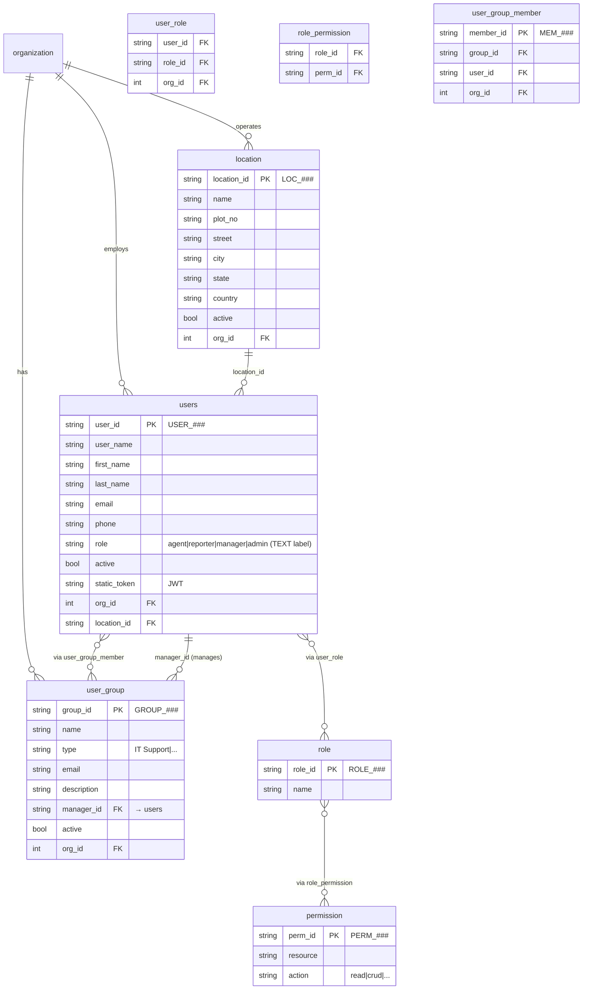

# ITSM Domain — Exploration Notepad

_Source: `gym_dbs.zip` → `Domain Wise DBs and Task-DB Mappings/itsm/dbs/` + HF dataset `ServiceNow-AI/EnterpriseOps-Gym` (for task configs / tool names)._

MCP server: `gym-itsm-mcp` (Docker image `shivakrishnareddyma225/enterpriseops-gym-mcp-itsm:latest`), default port **8006**. Internal name `sn-itsm-internal`.

---

## 1. DB files on disk

| File | Rows | Tables | Snapshot name | Date |
|---|--:|--:|---|---|
| `db_1765301900121_3mwjj54xy.sql` | 241 | 24 | `anmol-itsm-db-v1` | 2025-12-09 |
| `db_1765984530018_6f72jkf3p.sql` | 242 | 24 | `sn-itsm-shashank-16` | 2025-12-17 |
| `db_1765893060767_9rwtfbbp7.sql` | 914 | 24 | `itsm-4-prathamesh` | 2025-12-16 |
| `db_1765949061488_6sskwu6en.sql` | 914 | 24 | `sn-itsm-shree-seed` | 2025-12-17 |
| `db_1766063289316_o5f6sbf3g.sql` | 914 | 24 | `sn-itsm-shashank-17` | 2025-12-18 |
| `db_1766091624245_iotwhtzd5.sql` | 914 | 24 | `itsm-15v1-prathamesh` | 2025-12-18 |
| `db_1768479715490_ex6u7viv2.sql` | 914 | 24 | `itsm_swayankar_db6` | 2026-01-15 |
| `db_1766289728874_6ecz8xaeu.sql` | 915 | 24 | `itsm-17v3-prathamesh` | 2025-12-21 |
| `db_1766420030407_0anxy19de.sql` | 916 | 24 | `sn-itsm-vinod16` | 2025-12-22 |

9 DBs but really **3 templates**:
- **"Minimal"** (~242 rows, 2 DBs: `_3mwjj54xy`, `_6f72jkf3p`) — row-for-row identical except for 1 row in `configuration_item` (4 vs 5).
- **"Rich"** (~914 rows, 7 DBs) — `9rwtfbbp7`, `6sskwu6en`, `o5f6sbf3g`, `iotwhtzd5`, `ex6u7viv2` are byte-for-byte twins (914 rows, identical table counts). `6ecz8xaeu` differs by 1 row (`incident_sla`: 27 vs 26). `0anxy19de` differs by 2 rows (`change_request_mapping` 17 vs 16, `problem` 11 vs 10).

All 9 declare the same 24 tables. Schemas are implicit (no `CREATE TABLE`).

---

## 2. Schema / tables (24)

ServiceNow-ITIL shaped. Row counts are from the rich DB `…9rwtfbbp7`.

**Organization / RBAC**
- `organization` (20) — `org_id, name, active, created_at, updated_at`
- `users` (100) — `user_id, user_name, first_name, last_name, email, phone, role (agent|reporter|manager|admin), active, static_token (JWT), org_id, location_id, created_on, updated_on`
- `role` (4) — `role_id, name`
- `permission` (36) — `perm_id, resource, action (read|crud|...)`
- `role_permission` (72) — `role_id, perm_id`
- `user_role` (100) — `user_id, role_id, org_id`
- `user_group` (8) — `group_id, name, type, active, email, description, manager_id, org_id, …`
- `user_group_member` (28) — `member_id, group_id, user_id, org_id, …`
- `location` (23) — `location_id, name, org_id, plot_no, street, city, state, country, active, …`

**Core ITIL entities**
- `incident` (100) — 32 cols: `incident_id, number (INC-XXXXXX), short_description, caller_id, service, service_offering, configuration_item, assigned_to, assignment_group, resolved_by, problem, change_request, caused_by_change, incident_template, parent_incident, org_id, channel, contact_type, status, category, description, worknotes, resolution_notes, close_notes, impact, urgency, priority, resolution_code, on_hold_reason, resolved, created_at, updated_at`
- `problem` (10) — 22 cols: `problem_id, number (PRBXXXXXXX), problem_statement, short_description, opened_by, service, service_offering, configuration_item, assigned_to, assignment_group, original_task, org_id, status, category, worknotes, workaround, fix_notes, impact, urgency, priority, …`
- `change` (25) — 23 cols: `change_id, number (CHGXXXXXXX), short_description, requested_by, service, service_offering, configuration_item, assigned_to, assignment_group, org_id, status, category, description, implementation_plan, testing_plan, close_notes, cab_required, impact, priority, risk, close_code, …`

**Relationships / dependency tables**
- `incident_affected_cis` (14) — `incident_affected_cis_id (TASKCI_XXX), incident_id, configuration_item, org_id, …`
- `incident_template` (10) — `incident_template_id (TMPL_XXX), name, active, caller_id, channel, short_description, category, impact, urgency, priority, configuration_item, service, service_offering, org_id, …`
- `child_incident` (6) — `child_incident_mapping_id (CINC_XXX), parent_incident, child_incident, …` (separate join table — `incident.parent_incident` field is also populated directly)
- `change_request_mapping` (16) — `change_request_mapping_id (CRM_XXX), change_id, incident_id, problem_id, org_id, …` (polymorphic: either `incident_id` or `problem_id` is set, not both)

**CMDB**
- `configuration_item` (100) — `configuration_item_id (CI_XXX), name, serial_number, owner_id, location_id, org_id, status (in_use|maintenance|in_stock|retired|disposed), cost (decimal), …`
- `service` (48) — `service_id (SVC_XXX), name, owned_by, org_id, used_for (production|QA|test|development), status (operational|ready|repair_in_progress|non-operational|retired), service_classification (business|application|technology-management), business_criticality (critical|somewhat-critical|less-critical|not-critical), description, …`
- `service_offering` (60) — `service_offering_id (SVCOFF_XXX), name, short_description, owned_by, business_service (→ service), org_id, used_for, status, service_classification, business_criticality, description, …`

**SLAs**
- `sla_definition` (8) — `sla_def_id (SLA_XXX), name, metric (response|resolution), target_mins, pause_on_pending (bool), applies_to_priority (critical|high|moderate|low), active, schedule (24x7|8-5 Weekdays), org_id, …`
- `incident_sla` (26) — `incident_sla_id (TSLA_XXX), incident_id, sla_def_id, org_id, stage (in_progress|completed|paused|breached), has_breached (bool), start_time, breach_time, completed_time, …`

**Knowledge**
- `knowledge` (25) — `knowledge_id (KB_XXX), kb_number (KB0000XXX), title, short_description, body, state (published|draft|review|retired), visibility (internal|external), owner_id, org_id, …`
- `incident_knowledge` (45) — `incident_kb_id (IKB_XXX), incident_id, knowledge_id, org_id, used_as (resolution|suggested|applied), created_on`

**Notifications**
- `notification` (30) — `notification_id (NOTIF_XXX), incident_id, org_id, email, subject, message, type (update|solution_proposal|alert|reminder|report|other), status (opened|delivered|sent|queued|failed), …`

---

## 3. Sample rows per table

_(Two representative samples per table, drawn from the rich DB `db_1765893060767_9rwtfbbp7.sql`. Long values truncated with `…`.)_

### `organization`
- `ORG_001` / 'ServiceNow' / active
- `ORG_002` / 'Globex Corporation' / active

### `users`
- `USER_001` / thomas.green / `thomas.green@servicenow.com` / +44206753369 / role=`agent` / **active=FALSE** / `static_token=eyJhbGci…` (JWT with `"sub":"USER_001","iss":"itsm"`) / org=ORG_001 / loc=LOC_001
- `USER_002` / christina.oliver / role=`reporter` / active=TRUE / org=ORG_002 / loc=NULL

### `role`
- `ROLE_001` / 'admin'
- `ROLE_002` / 'agent'

### `permission`
- `PERM_001` / users / read
- `PERM_002` / users / crud

### `user_group`
- `GROUP_001` / 'L1 IT Support' / type='IT Support' / `l1.support@acme.com` / manager=USER_002
- `GROUP_002` / 'L2 IT Support' / description='Level 2 General IT Support and Escalations'

### `user_group_member`
- `MEM_001` / GROUP_001 / USER_001
- `MEM_002` / GROUP_001 / USER_005

### `location`
- `LOC_001` / 'ACME HQ' / 3250 Jay St / Santa Clara, CA / USA
- `LOC_002` / 'NYC Sales Office' / 101 Broadway / New York, NY / USA

### `configuration_item`
- `CI_001` / 'SAP-DB-01 (Oracle Database)' / serial=`SRV-ORC-9981` / owner=USER_001 / loc=LOC_003 / status=`in_use` / cost=$15,000.00
- `CI_002` / 'SAP-APP-01 (Application Server)' / serial=`SRV-LNX-4421` / cost=$12,000.00

### `service`
- `SVC_001` / 'Enterprise Email' / owned_by=USER_004 / `used_for='production'`, `status='operational'`, `service_classification='business'`, `business_criticality='critical'` / "Core Exchange and Outlook Services"
- `SVC_002` / 'Global Payroll' / critical business service

### `service_offering`
- `SVCOFF_001` / 'Enterprise Email - Gold' / short="24/7 Priority Support" / `business_service='SVC_001'` / "High availability email for executives"
- `SVCOFF_002` / 'Global Payroll - Standard' / "Monthly processing"

### `incident`
- `INC_001` / 'INC-000001' / **"MAJOR:SAP Database Unreachable"** / caller=USER_001 / service=SVC_017 / CI=CI_001 / assigned_to=USER_059 / group=GROUP_008 / `channel='web'`, `contact_type='api'`, `status='in_progress'`, `category='database'` / impact=high, urgency=high, priority=`critical` / worknotes="DBA investigating."
- `INC_044` / 'INC-000044' / "SAP Transaction Lagging" / `parent_incident='INC_001'` / `status='on_hold'` / `on_hold_reason='Awaiting Problem'`

### `incident_template`
- `TMPL_001` / 'Password Reset Request' / channel='self-service' / category='password-reset' / priority='low'
- `TMPL_002` / 'VPN Connection Failure' / channel='self-service' / category='network' / priority='moderate'

### `incident_affected_cis`
- `TASKCI_001` / INC_001 / CI_002
- `TASKCI_002` / INC_001 / CI_017

### `incident_knowledge`
- `IKB_001` / INC_001 / KB_004 / `used_as='resolution'`
- `IKB_002` / INC_007 / KB_004 / `used_as='resolution'`

### `incident_sla`
- `TSLA_001` / INC_001 / SLA_001 / `stage='completed'`, `has_breached=FALSE`, start=08:00, completed=08:05
- `TSLA_002` / INC_001 / SLA_002 / `stage='in_progress'`, breach_time=12:00

### `sla_definition`
- `SLA_001` / 'Priority 1 - Response' / metric='response' / **target_mins=15** / pause_on_pending=FALSE / applies_to_priority='critical' / schedule='24x7'
- `SLA_002` / 'Priority 1 - Resolution' / metric='resolution' / **target_mins=240** / pause_on_pending=TRUE

### `child_incident`
- `CINC_001` / parent=INC_001 / child=INC_044
- `CINC_002` / parent=INC_001 / child=INC_069

### `problem`
- `PRB_001` / 'PRB0000001' / 'Recurring instability in SAP Oracle Database' / opened_by=USER_001 / CI=CI_001 / assigned_to=USER_059 / **original_task=`INC_001`** / `status='fix_in_progress'`, priority='critical' / workaround="Restart the Oracle Service every 24 hours until patch applied." / fix_notes="Vendor patch 19.4.2 required. Change Request CHG001 created."
- `PRB_002` / 'Core Switch Port 24 Flapping impacting HQ' / original_task=INC_003 / `status='resolved'`

### `change`
- `CHG_001` / 'CHG0000001' / 'Apply Oracle Patch 19.4.2 to SAP DB' / requested_by=USER_059 / CI=CI_001 / `status='scheduled'`, `cab_required=TRUE`, impact=high, risk=high, priority=high / implementation_plan="1. Stop SAP Services. 2. Apply DB Patch. 3. Restart DB. 4. Start SAP."
- `CHG_002` / 'Replace Line Card on Core Switch' / `status='authorize'`, risk=medium

### `change_request_mapping`
- `CRM_001` / CHG_007 / INC_052 / problem_id=NULL
- `CRM_002` / CHG_009 / INC_028 / problem_id=NULL

### `knowledge`
- `KB_001` / 'KB0000001' / 'Self-Service Password Reset' / body="Go to the portal and click Forgot Password. You will need your MFA token." / `state='published'`, `visibility='external'` / owner=USER_001
- `KB_002` / 'KB0000002' / 'Setting up MFA on iOS' / external / owner=USER_049

### `notification`
- `NOTIF_001` / INC_001 / email=`gregory.richards36@servicenow.com` / subject="MAJOR INCIDENT ALERT:INC0000001 - SAP DB Unreachable" / type=`alert`, status=`opened`
- `NOTIF_002` / INC_001 / email=`thomas.green@servicenow.com` / subject="Incident INC0000001 Created" / type=`update`, status=`delivered`

### `user_role`
- USER_001 / ROLE_002 (agent) / ORG_001
- USER_002 / ROLE_004 / ORG_002

### `role_permission`
- ROLE_001 (admin) / PERM_002
- ROLE_001 / PERM_004

---

## 4. Actual enum vocabularies (observed in rich DB)

| Column | Values |
|---|---|
| `users.role` | `reporter` (47), `agent` (35), `manager` (9), `admin` (9) |
| `incident.status` | `resolved` (41), `new` (21), `in_progress` (18), `on_hold` (10), `closed` (10) |
| `incident.priority` | `moderate` (26), **`planning`** (26), `low` (24), `high` (15), `critical` (9) |
| `incident.impact` | `low` / `medium` / `high` |
| `incident.urgency` | `low` / `medium` / `high` |
| `incident.channel` | `self-service`, `email`, `phone`, `web`, `walk-in`, `chat` |
| `incident.contact_type` | `portal`, `email`, `phone`, `api`, **`walk_in`** _(note: underscore)_, `chat` |
| `incident.category` | `hardware` (41), `software` (17), `password-reset` (17), `network` (13), `inquiry-help` (8), `database` (4) |
| `change.status` | `closed` (6), `scheduled` (5), `review` (3), `authorize` (2), `assess` (2), `implement` (2), `new` (2), `canceled` (2) |
| `change.priority` | **`medium`** (not `moderate`), `low`, `critical`, `high` |
| `change.risk` | `low` / `medium` / `high` |
| `problem.status` | `fix_in_progress`, `resolved`, `assess`, `closed`, `new`, `root_cause` |
| `problem.priority` | mirrors `incident` — includes `planning` |
| `configuration_item.status` | `in_use` (69), `maintenance` (12), `in_stock` (6), `retired` (3), `disposed` (1) |
| `service.status` | `operational` (17), `ready` (11), `repair_in_progress` (8), `non-operational` (5), `retired` (5) |
| `service.service_classification` | `business`, `application`, `technology-management` |
| `service.business_criticality` | `critical`, `somewhat-critical`, `less-critical`, `not-critical` |
| `service.used_for` | `production`, `QA`, `test`, `development` |
| `notification.type` | `update`, `solution_proposal`, `alert`, `reminder`, `report`, `other` |
| `notification.status` | `opened` (11), `delivered` (9), `sent` (6), `queued` (2), `failed` (2) |
| `sla_definition.metric` | `response`, `resolution` |
| `sla_definition.schedule` | `8-5 Weekdays` (6), `24x7` (2) |
| `incident_sla.stage` | `in_progress`, `completed`, `paused`, `breached` |
| `knowledge.state` | `published` (21), `retired` (2), `draft` (1), `review` (1) |
| `knowledge.visibility` | `external` (13), `internal` (12) |
| `incident_knowledge.used_as` | `resolution` (21), `suggested` (15), `applied` (9) |

---

## 5. Tools exposed by the ITSM MCP server

Tool definitions live in the MCP Docker image; enumerated here from the HF task dataset.

**Task counts**: 103 ITSM tasks × 4 modes = 412 configs.

**Tools-per-task size**:
- `oracle`: 4 – 14 (median **6**)
- `plus_5_tools`: 9 – 19 (median 11)
- `plus_10_tools`: 13 – 24 (median 16)
- `plus_15_tools`: 19 – 29 (median 21)

**91 distinct ITSM tools** observed. Grouped by area (counts = # tasks listing the tool):

### Users / groups (10)
`get_user (408)`, `get_user_using_name (302)`, `list_users (257)`, `get_user_using_email (249)`, `update_user_details (140)`, `add_new_user (113)`, `find_group_by_name (153)`, `list_user_groups (150)`, `add_new_group_member (98)`, `list_group_members (97)`, `add_new_user_group (78)`, `update_user_group (78)`, `remove_group_membership (65)`

### Incidents (13)
`update_incident (237)`, `list_incidents (217)`, `create_incident (196)`, `find_incident_by_number (196)`, `get_incidents_assigned_to (105)`, `find_incident_by_id (103)`, `link_knowledge_to_incident (106)`, `link_affected_ci_to_incident (52)`, `list_incident_affected_cis (36)`, `find_incident_knowledge_links (29)`, `add_child_incident (25)`, `list_child_incidents (38)`, `find_parent_incident (19)`, `remove_affected_ci_from_incident (9)`, `remove_knowledge_link_to_incident (9)`, `remove_child_incident (4)`, `add_child_incidents (8)`, `count_incident_for_assignment_group (9)`, `get_count_of_incident_priority_wise (8)`

### Problems (4)
`create_problem (50)`, `list_problems (41)`, `find_problem_by_number (39)`, `update_problem (39)`, `get_problems_assigned_to (11)`

### Changes (6)
`update_change (28)`, `map_change_request (27)`, `list_change_request_mappings (26)`, `list_changes (25)`, `find_change_by_number (24)`, `create_change (22)`, `find_change_request_mappings_for_incident (16)`, `find_change_request_mappings_for_problem (14)`, `delete_change_request_mappings (6)`, `get_changes_assigned_to (8)`

### Configuration items (5)
`find_configuration_items (146)`, `find_configuration_item_by_serial_number (128)`, `update_configuration_item (109)`, `register_configuration_item (68)`

### Services (6)
`find_service_by_name (102)`, `find_services (99)`, `find_service_offerings (63)`, `update_service (49)`, `update_service_offering (38)`, `add_new_service (34)`, `register_new_service_offering (25)`, `find_service_offering_by_name (32)`

### Locations (4)
`find_locations (103)`, `find_location_by_given_name (97)`, `get_location_by_id (57)`, `add_location (55)`, `update_location (28)`

### Knowledge (4)
`retrieve_knowledge_articles (76)`, `create_knowledge_article (34)`, `update_knowledge_article (13)`

### Notifications (7)
`send_notification (214)`, `find_notifications_sent_for_incident (59)`, `find_notifications (54)`, `update_notification (42)`, `count_notifications_by_incident (29)`, `find_notifications_for_email (17)`, `count_notifications_by_status (10)`, `delete_notifications (7)`, `count_notifications_by_type (2)`

### SLAs (7)
`find_incident_slas (52)`, `link_new_incident_sla (43)`, `update_incident_sla_details (35)`, `find_sla_definitions (33)`, `find_sla_definition_by_name (14)`, `find_stage_wise_breached_incident_sla_counts (6)`, `delete_incident_slas (6)`, `add_new_sla_definition (2)`, `average_target_mins_per_priority (1)`, `total_sum_of_target_mins_per_priority (1)`

### Incident templates (3)
`get_incident_template_by_name (15)`, `create_new_incident_template (13)`, `update_incident_template (7)`, `get_incident_templates (3)`

Incidents dominate tool usage (11 top-50 tools are incident-related). Naming is consistent (`find_*` for searches, `list_*` for dumps, `create_*`/`add_*` for inserts, `update_*` for mods, `remove_*`/`delete_*` for removes). Three "analytics" tools (`count_*`, `average_*`, `total_sum_*`) exist but are rarely used.

---

## 6. Fidelity observations

- **9 DBs → 3 templates.** 7 of 9 large DBs are byte-for-byte duplicates. The two "small" DBs (~242 rows) are mostly stub data and only used by 41 of 103 tasks.
- **Rich ITIL surface.** Full incident–problem–change lifecycle, CMDB with CI costs and serial numbers, SLA definitions with response/resolution metrics, incident-CI affected mappings, parent-child incident links, knowledge linkage with `used_as`, SLA breach tracking via `incident_sla.stage` / `has_breached`. This is the most feature-complete of the ITSM-style domains.
- **JWT tokens in `users.static_token`** explicitly encode the user_id and `iss:"itsm"` — deterministic, safe for tests.
- **Enum inconsistencies worth knowing:**
  - `incident.priority` includes **`planning`** alongside critical/high/moderate/low — unusual in ITIL practice (planning is usually a lifecycle state, not a priority). 26 of 100 incidents use it.
  - **`moderate` vs `medium` mismatch across tables.** Incident priority uses `moderate`; change priority uses `medium`. Joining across both needs translation.
  - **`walk-in` vs `walk_in`** — `incident.channel` uses the hyphenated form, `incident.contact_type` uses the underscore form. Easy verifier trap.
  - `change.status` has 8 distinct values (`closed, scheduled, review, authorize, assess, implement, new, canceled`) — full CAB lifecycle. Note US spelling `canceled` (single-l) vs HR domain's `cancelled` (double-l).
- **`cost` column on `configuration_item`** is a decimal (e.g. 15000.00, 12000.00) — supports spend queries.
- **SLA timing looks plausible** — 15-min response, 240-min resolution for P1; schedule mostly `8-5 Weekdays` with only 2 defs at `24x7`. `incident_sla.breach_time` is computed at start_time + target, so a future breach_time means the SLA is still running.
- **Polymorphic `change_request_mapping`** — holds either `incident_id` or `problem_id` (always exactly one). No DB-level check constraint, just a convention.
- **Two parent–child incident representations** — `incident.parent_incident` FK AND separate `child_incident` join table. The samples show both populated consistently (INC_044's parent = INC_001, and CINC_001 maps INC_001→INC_044). A dual-source-of-truth risk.
- **Some user timestamps are future** — `users.updated_on = '2026-06-02 22:51:28'` while the DB was generated in Dec 2025. Same artifact seen in HR.

---

## 7. Schema diagram

Relationships inferred from column names and sample FK values — the dumps ship no `CREATE TABLE` and no declared FKs. Every entity carries `org_id`; those edges are omitted from the diagrams for readability (one edge to `organization` is drawn per diagram as a reminder).

### 7a. Core ITIL: incidents, problems, changes, CMDB, SLAs, knowledge

```mermaid
erDiagram
    organization ||--o{ users              : "employs"

    users         ||--o{ incident          : "caller_id"
    users         ||--o{ incident          : "assigned_to"
    users         ||--o{ incident          : "resolved_by"
    user_group    ||--o{ incident          : "assignment_group"
    service       ||--o{ incident          : "service"
    service_offering ||--o{ incident       : "service_offering"
    configuration_item ||--o{ incident     : "configuration_item"
    incident_template ||--o{ incident      : "incident_template"
    problem       ||--o{ incident          : "problem"
    change        ||--o{ incident          : "change_request"
    change        ||--o{ incident          : "caused_by_change"
    incident      ||--o{ incident          : "parent_incident (self-ref)"

    incident      ||--o{ incident_affected_cis   : "affects"
    configuration_item ||--o{ incident_affected_cis : "is affected by"

    incident      ||--o{ child_incident    : "parent"
    incident      ||--o{ child_incident    : "child"

    incident      ||--o{ incident_sla      : "has SLA instance"
    sla_definition ||--o{ incident_sla     : "defines"

    incident      ||--o{ incident_knowledge : "links to"
    knowledge     ||--o{ incident_knowledge : "linked as"
    users         ||--o{ knowledge          : "owner_id"

    incident      ||--o{ notification      : "triggers"

    users         ||--o{ problem           : "opened_by"
    users         ||--o{ problem           : "assigned_to"
    user_group    ||--o{ problem           : "assignment_group"
    service       ||--o{ problem           : "service"
    configuration_item ||--o{ problem      : "configuration_item"
    incident      ||--o{ problem           : "original_task"

    users         ||--o{ change            : "requested_by"
    users         ||--o{ change            : "assigned_to"
    user_group    ||--o{ change            : "assignment_group"
    service       ||--o{ change            : "service"
    configuration_item ||--o{ change       : "configuration_item"

    change        ||--o{ change_request_mapping  : "maps"
    incident      ||--o{ change_request_mapping  : "or incident"
    problem       ||--o{ change_request_mapping  : "or problem"

    service       ||--o{ service_offering  : "parent service"
    users         ||--o{ service           : "owned_by"
    users         ||--o{ service_offering  : "owned_by"
    users         ||--o{ configuration_item : "owner_id"
    location      ||--o{ configuration_item : "location_id"

    users         ||--o{ incident_template : "caller_id"
    service       ||--o{ incident_template : "service"
    configuration_item ||--o{ incident_template : "configuration_item"

    incident {
      string incident_id         PK "INC_###"
      string number              "INC-######"
      string short_description
      string caller_id           FK "→ users"
      string service             FK
      string service_offering    FK
      string configuration_item  FK
      string assigned_to         FK "→ users"
      string assignment_group    FK "→ user_group"
      string resolved_by         FK "→ users"
      string problem             FK
      string change_request      FK "→ change"
      string caused_by_change    FK "→ change"
      string incident_template   FK
      string parent_incident     FK "→ incident (self-ref)"
      string channel             "self-service|email|phone|web|walk-in|chat"
      string contact_type        "portal|email|phone|api|walk_in|chat"
      string status              "new|in_progress|on_hold|resolved|closed"
      string category
      string priority            "critical|high|moderate|low|planning"
      string impact              "low|medium|high"
      string urgency             "low|medium|high"
      string on_hold_reason
      string resolution_code
      string worknotes
      string resolution_notes
      string close_notes
      int    org_id              FK
    }
    problem {
      string problem_id          PK "PRB_###"
      string number              "PRB######"
      string problem_statement
      string status              "new|assess|root_cause|fix_in_progress|resolved|closed"
      string priority            "critical|high|moderate|low|planning"
      string original_task       FK "→ incident"
      string assigned_to         FK "→ users"
      string assignment_group    FK "→ user_group"
      string service             FK
      string configuration_item  FK
      string workaround
      string fix_notes
      int    org_id              FK
    }
    change {
      string change_id           PK "CHG_###"
      string number              "CHG######"
      string short_description
      string requested_by        FK "→ users"
      string assigned_to         FK "→ users"
      string assignment_group    FK "→ user_group"
      string service             FK
      string configuration_item  FK
      string status              "new|assess|authorize|scheduled|implement|review|closed|canceled"
      string category
      string priority            "critical|high|medium|low"
      string impact              "low|medium|high"
      string risk                "low|medium|high"
      bool   cab_required
      string implementation_plan
      string testing_plan
      string close_code
      int    org_id              FK
    }
    incident_affected_cis {
      string incident_affected_cis_id  PK "TASKCI_###"
      string incident_id         FK
      string configuration_item  FK
      int    org_id              FK
    }
    child_incident {
      string child_incident_mapping_id PK "CINC_###"
      string parent_incident     FK "→ incident"
      string child_incident      FK "→ incident"
    }
    change_request_mapping {
      string change_request_mapping_id PK "CRM_###"
      string change_id           FK
      string incident_id         FK "nullable"
      string problem_id          FK "nullable (exactly one of incident_id/problem_id set)"
      int    org_id              FK
    }
    incident_template {
      string incident_template_id PK "TMPL_###"
      string name
      bool   active
      string caller_id           FK "→ users"
      string service             FK
      string service_offering    FK
      string configuration_item  FK
      string channel
      string category
      string priority
      string impact
      string urgency
      int    org_id              FK
    }
    sla_definition {
      string sla_def_id          PK "SLA_###"
      string name
      string metric              "response|resolution"
      int    target_mins
      bool   pause_on_pending
      string applies_to_priority
      string schedule            "24x7|8-5 Weekdays"
      bool   active
      int    org_id              FK
    }
    incident_sla {
      string incident_sla_id     PK "TSLA_###"
      string incident_id         FK
      string sla_def_id          FK
      string stage               "in_progress|completed|paused|breached"
      bool   has_breached
      datetime start_time
      datetime breach_time       "computed as start_time + target_mins"
      datetime completed_time
      int    org_id              FK
    }
    incident_knowledge {
      string incident_kb_id      PK "IKB_###"
      string incident_id         FK
      string knowledge_id        FK
      string used_as             "resolution|suggested|applied"
      int    org_id              FK
    }
    knowledge {
      string knowledge_id        PK "KB_###"
      string kb_number           "KB#######"
      string title
      string short_description
      text   body
      string state               "published|draft|review|retired"
      string visibility          "external|internal"
      string owner_id            FK "→ users"
      int    org_id              FK
    }
    configuration_item {
      string configuration_item_id PK "CI_###"
      string name
      string serial_number
      string owner_id            FK "→ users"
      string location_id         FK
      string status              "in_use|maintenance|in_stock|retired|disposed"
      decimal cost
      int    org_id              FK
    }
    service {
      string service_id          PK "SVC_###"
      string name
      string owned_by            FK "→ users"
      string used_for            "production|QA|test|development"
      string status              "operational|ready|repair_in_progress|non-operational|retired"
      string service_classification "business|application|technology-management"
      string business_criticality "critical|somewhat-critical|less-critical|not-critical"
      string description
      int    org_id              FK
    }
    service_offering {
      string service_offering_id PK "SVCOFF_###"
      string name
      string business_service    FK "→ service"
      string owned_by            FK "→ users"
      string status
      string service_classification
      string business_criticality
      string used_for
      int    org_id              FK
    }
    notification {
      string notification_id     PK "NOTIF_###"
      string incident_id         FK
      string email               "raw string, not FK"
      string subject
      text   message
      string type                "update|solution_proposal|alert|reminder|report|other"
      string status              "opened|delivered|sent|queued|failed"
      int    org_id              FK
    }
```



### 7b. Identity, RBAC, locations



### 7c. Relationships at a glance

| From | FK column | To | Cardinality | Notes |
|---|---|---|---|---|
| `users` | `org_id` | `organization` | N:1 | every table has this |
| `users` | `location_id` | `location` | N:1 (nullable) | some users loc=NULL |
| `incident` | `caller_id` / `assigned_to` / `resolved_by` | `users` | N:1 | 3 separate user FKs |
| `incident` | `assignment_group` | `user_group` | N:1 | |
| `incident` | `service` / `service_offering` / `configuration_item` | respective tables | N:1 | all nullable |
| `incident` | `incident_template` | `incident_template` | N:1 (nullable) | |
| `incident` | `problem` | `problem` | N:1 (nullable) | "this incident is part of problem X" |
| `incident` | `change_request` / `caused_by_change` | `change` | N:1 (nullable) | two separate change FKs |
| `incident` | `parent_incident` | `incident` | self-ref | |
| `incident_affected_cis` | `incident_id`, `configuration_item` | `incident`, `configuration_item` | M:N link | |
| `child_incident` | `parent_incident`, `child_incident` | `incident`, `incident` | M:N link | **duplicates** `incident.parent_incident` FK |
| `incident_sla` | `incident_id`, `sla_def_id` | `incident`, `sla_definition` | M:N link | tracks running/completed/breached state per SLA |
| `incident_knowledge` | `incident_id`, `knowledge_id` | `incident`, `knowledge` | M:N link | carries `used_as` |
| `notification` | `incident_id` | `incident` | N:1 | `email` is raw string, not FK |
| `problem` | `original_task` | `incident` | N:1 | typical "originating" incident |
| `problem` | `opened_by` / `assigned_to` | `users` | N:1 | |
| `problem` | `service` / `configuration_item` / `assignment_group` | respective tables | N:1 | |
| `change` | `requested_by` / `assigned_to` | `users` | N:1 | |
| `change` | `service` / `configuration_item` / `assignment_group` | respective tables | N:1 | |
| `change_request_mapping` | `change_id` | `change` | N:1 | always set |
| `change_request_mapping` | `incident_id` | `incident` | N:1 (nullable) | **exactly one** of incident_id / problem_id populated |
| `change_request_mapping` | `problem_id` | `problem` | N:1 (nullable) | polymorphic — convention only, no DB constraint |
| `configuration_item` | `owner_id` | `users` | N:1 | |
| `configuration_item` | `location_id` | `location` | N:1 | |
| `service` | `owned_by` | `users` | N:1 | |
| `service_offering` | `business_service` | `service` | N:1 | |
| `service_offering` | `owned_by` | `users` | N:1 | |
| `knowledge` | `owner_id` | `users` | N:1 | |
| `incident_template` | `caller_id` / `service` / `service_offering` / `configuration_item` | respective tables | N:1 | template for seeding new incidents |
| `user_group` | `manager_id` | `users` | N:1 | |
| `user_role` | `user_id` / `role_id` | `users`, `role` | M:N link | |
| `role_permission` | `role_id` / `perm_id` | `role`, `permission` | M:N link | |
| `user_group_member` | `group_id` / `user_id` | `user_group`, `users` | M:N link | carries its own `member_id` PK |
| `sla_definition` | — | — | — | not FK'd from anywhere except via `incident_sla` |
| `location` | — | — | — | FK'd by `users.location_id` and `configuration_item.location_id` |

### 7d. Quirks worth knowing (schema)

- **Two parent-child representations**. `incident.parent_incident` (FK on the child incident row) and `child_incident` (separate join table with `CINC_###` IDs) both exist and are seeded consistently in the samples. The MCP probably writes to both, but reads from either — easy to get out of sync.
- **`change_request_mapping` is polymorphic**. Either `incident_id` OR `problem_id` is populated, never both. There's no check constraint in the dumps — if a tool writes both, the DB won't reject it.
- **`incident.problem`, `incident.change_request`, `incident.caused_by_change` are all denormalized** — the same info can live in `change_request_mapping`. A consistent write needs to update both sides.
- **Dual priority vocabularies**. `incident`/`problem` use `critical|high|moderate|low|planning`; `change` uses `critical|high|medium|low`. `medium` ≠ `moderate` textually, and `planning` has no analogue in `change`.
- **Two "walk-in" spellings** on the same `incident` row: `channel='walk-in'`, `contact_type='walk_in'`. Verifier SQL that hardcodes one spelling will miss rows that use the other.
- **`users.role` is a text label** ('agent', 'reporter', 'manager', 'admin') — independent of the `user_role` M:N link to `role.name`. Two sources of truth; they happen to agree in seed data but an update could desync them.
- **`notification.email`** is a raw string, not a FK to `users.email`. Notifications can go to addresses that don't exist as users.
- **`knowledge`, `location`, `service`, `service_offering`** have no direct link to `incident_template` or to each other beyond `service_offering.business_service → service`. The catalog is thin.
- **`sla_definition` is standalone config** — only `incident_sla` references it. No task verifier checks `sla_definition` rows, so the config is effectively immutable in tests.
- **No PKs** visible on `user_role` or `role_permission` (pure M:N link tables). `user_group_member` has its own `MEM_###` PK; `incident_affected_cis`, `child_incident`, `incident_knowledge`, `change_request_mapping` all carry explicit PKs (unusual for link tables but makes tool calls easier).

---

## 8. Task patterns in `ServiceNow-AI/EnterpriseOps-Gym`

_103 tasks × 4 modes = 412 configs. HF dataset, `itsm` split._

### 8a. Shape
- **Verifier type**: 100% `database_state` (464 verifiers across 103 oracle tasks).
- **Verifiers per task**: min 1, median **4**, max 18, mean 4.5 — lower than HR's median 6.
- **Comparison types**: 100% `equals`. No `greater_than` verifiers in ITSM (unlike HR).
- **Top expected values**: `1` (91%), `2` (4%), `3` (2%), `0` (1%).
- **Query complexity**: median 163 chars, max 960, JOINs median 0, max 5. Simpler than HR's verifiers (which ran up to 1,499 chars with 8 JOINs).
- **Prompt length**: 202 – **8,398 chars**, median 612. Has a couple of very long prompts.
- **System prompt variants**: 2 (same content, different markdown formatting).
- **Seed DB use**: 51 tasks use rich DB `_9rwtfbbp7`, 40 tasks use minimal DB `_3mwjj54xy`. The other 7 rich DBs and 1 minimal DB cover the remaining 12 tasks. So the workload is largely **two-DB** (one rich + one minimal).

### 8b. Top tool co-occurrences

Incident-centric flows dominate. The single most-cited tool is `get_user` (408 appearances) — essentially every task begins with a user lookup.

### 8c. Verifier SQL — tables checked

```
incident:153  notification:92  users:50  configuration_item:44  incident_knowledge:43
incident_sla:28  user_group_member:24  service:24  service_offering:23  location:19
user_group:18  knowledge:18  problem:17  change:11  incident_affected_cis:8
change_request_mapping:7  child_incident:7  incident_template:2
```

- **Incident dominates** (33% of verifier query targets).
- **Notifications are the #2 verification target** (20%) — tasks commonly end with "send a notification to X" and the DB verifier counts rows in `notification`.
- **`sla_definition` isn't verified at all** — SLAs are read-only configuration.
- **`knowledge` (18) + `incident_knowledge` (43) = 61** — knowledge linkage is heavily validated.

### 8d. Task intents (regex match on user prompts)

| Intent | # tasks |
|---|--:|
| Priority / urgency / impact handling | 56 |
| Create incident | 52 |
| Notify / email / alert | 38 |
| Update incident | 32 |
| CI / CMDB operations | 32 |
| Knowledge attach / create | 19 |
| Permission / role | 16 |
| Resolve / close | 15 |
| User onboard / add | 14 |
| Problem management | 12 |
| Parent / child / major incident | 11 |
| Group mgmt | 10 |
| Reassign | 8 |
| Escalation | 7 |
| Service mgmt | 6 |
| SLA | 5 |
| Change management | 5 |
| Incident templates | 1 |

Fewer case-reassignment and offboarding tasks than HR, more CI/CMDB tasks (a CMDB-heavy domain).

### 8e. Prompt patterns & voice

Four representative shapes:

1. **Operational agent voice** — short, ITIL-flavored:
   > "I have been working on incident INC‑000057 for some time, and after detailed analysis… a standard change to be created so that the deployment can be managed during the change window."
   _Expects: create change row with specific impact/risk/priority, link via `change_request_mapping`, notify caller._

2. **Service-decommission voice** — multi-entity ripple effect:
   > "The Enterprise Email service is being phased out… ensure that any open incidents related to this service are closed, and that the service owner is off-boarded, as the service has been switched to a different cloud-based platform."
   _Expects: `service` retired, all its offerings retired, open incidents closed, user deactivated._

3. **Deeply-nested narrative** with implicit entity resolution (the most demanding pattern):
   > "Please work with the oldest resolved incident handled by the IT Support Team, together with the child incident associated with it, as the resolver of that child incident should take responsibility for a new incident… based on a report submitted through email by Isabella, who indicated that the service owned by me is experiencing severe connectivity and network failures on the item located in San Francisco with a cost greater than 2000."
   _Requires: find oldest resolved INC by group, get its child INC, find Isabella, find a CI in SF with cost > 2000, tie them together with two alert notifications + subject lines._

4. **Hardware-specific story** — tests cross-table resolution:
   > "A new office printer (serial number: PRN-LDN-221) was recently installed at the London development center, purchased for 8000 GBP… Benjamin Chen reported… severe performance degradation, … medium impact and a high sense of urgency."
   _Expects: CI registration with serial + location + cost, then an incident linking CI + caller + template + L1 group._

### 8f. System prompt — ITSM policy document

The shipped system prompt is an **"ITSM Assistant Policy"** (~8 KB) with two variants differing only in markdown formatting. Distinguishing feature from the HR policy: a parenthetical note explicitly flags a reconciliation against the data:

> _"Roles renamed and permissions corrected to align with DB/Tool data: `ITIL Agent` → `Agent`, `End User` → `Reporter`. Permissions for Agent and Manager corrected."_

So **ITSM's policy ↔ data gap is smaller than HR's** by design. The policy also does not enumerate every status/priority value, leaving room for the model to match what it observes.

Residual divergences still exist:
- Policy doesn't enumerate the 8 `change.status` values, the 6 `problem.status` values, or the unusual `planning` priority on incidents. A model that sticks to ITIL canon (`new → in_progress → resolved → closed`) will still miss `assess`, `root_cause`, `fix_in_progress`.
- Policy treats `walk_in` / `walk-in` uniformly — the dual spelling is a data quirk the model must observe.
- `incident.contact_type='portal'` vs `channel='self-service'` is undocumented.

### 8g. Brittleness notes

- **ID-prediction verifiers are common**: e.g., a task requires `change_id='CHG_026'` (the 26th change, when the DB has 25 seeded), `incident_sla_id='TSLA_XXX'` etc. Creating rows out of order will shift the id sequence and fail verifiers.
- **Notification text-matching via LIKE** — a task verifier uses `message LIKE '%status%' AND message LIKE '%progress%'`. Fragile to wording but tolerant of exact phrasing.
- **Exact subject strings required**: e.g. `subject = 'Network Access Issue Logged - Service Impact Notification'` must be produced verbatim.
- **Cost / currency not schema-typed** — `configuration_item.cost` is decimal, but the prompt specifies "8000 GBP" and the DB stores a single `cost` number with no currency column. The agent must drop the currency implicitly.

---

## 9. Designer's notes — what each table is for and why it's shaped this way

_A walkthrough as if from the architect who built this schema. The shape is a faithful subset of the ITIL v4 / ServiceNow data model._

### The big picture

ITIL is the standard for IT service management. It defines a small handful of operational records — **Incidents** (something is broken), **Problems** (we don't know why it keeps breaking), **Changes** (we want to modify production) — and a configuration backbone — the **CMDB** (Configuration Management Database) of the things being managed. Around these sit **Knowledge** (recorded fixes), **SLAs** (timing commitments), and a routing/identity layer (users, groups, roles).

This 24-table schema models that operational core. It deliberately leaves out service request fulfillment, workflow/orchestration, CI-to-CI relationships, approvals, and audit logs — those are tasks-out-of-scope, and including them would have doubled the table count without changing what an agent has to reason about.

The schema layers cleanly:

```
   ┌─────────────────────────────────────────────────────────┐
   │  Communication      notification                        │
   ├─────────────────────────────────────────────────────────┤
   │  Linkage            incident_affected_cis, child_incident,
   │                     incident_sla, incident_knowledge,
   │                     change_request_mapping              │
   ├─────────────────────────────────────────────────────────┤
   │  Operational        incident, problem, change           │
   ├─────────────────────────────────────────────────────────┤
   │  Catalog (config)   service, service_offering,
   │                     configuration_item, sla_definition,
   │                     knowledge, incident_template        │
   ├─────────────────────────────────────────────────────────┤
   │  Foundation         organization, users, role,
   │                     permission, user_role,
   │                     role_permission, user_group,
   │                     user_group_member, location         │
   └─────────────────────────────────────────────────────────┘
```

Foundation tables are seeded once and edited rarely; catalog tables are admin-managed; operational tables churn constantly; linkage tables track relationships that evolve over an incident's life; the communication layer is mostly write-only.

---

### Foundation layer

**`organization`** is the multi-tenant boundary. Every other table carries `org_id` so a single deployment can serve multiple customers (ServiceNow, Globex, etc.) without schema separation. We chose row-level tenancy over per-tenant schemas because (a) it keeps DDL stable, (b) it lets tools share definitions of services/SLAs/templates across orgs as needed, and (c) it's how ServiceNow itself works. The tradeoff: every query must filter by `org_id` or risk leaking across tenants. This is intentional friction — verifiers in the gym will sometimes test that an agent didn't update rows in the wrong org.

**`users`** is the canonical identity record. The `role` text field is a denormalized fast-path label ('agent', 'reporter', 'manager', 'admin') because almost every authorization check in the tool layer needs it; we didn't want every check to JOIN through `user_role`. The full RBAC truth lives in `user_role` + `role` + `role_permission` + `permission` and supports the realistic case of one user holding multiple roles. Consequence: `users.role` and `user_role` can drift. Tools should treat `users.role` as a read cache and `user_role` as authority.

**`role`** and **`permission`** are tiny and almost-static. Permissions are `(resource, action)` tuples like `(users, crud)` or `(incident, read)`. **`role_permission`** maps roles to those tuples — that's where the real authorization data lives. **`user_role`** is the M:N link assigning roles to users within an org.

**`user_group`** is the work-routing primitive. ITIL practice is to assign cases to groups, not individuals — groups have rotation, capacity sharing, and survive personnel changes. `manager_id` enables an escalation chain (the L1 group manager when an L1 case stalls). The `type` field ("IT Support", etc.) is informational; routing in the operational tables points at `group_id` directly.

**`user_group_member`** carries its own `MEM_###` PK rather than being a pure (group, user) tuple — this is so notifications and audit trails can reference specific membership events ("on 2025-12-09 Stephanie was added to GROUP_007"). Unusual for a link table; deliberate for traceability.

**`location`** is the physical geography. CIs live there, users work there, regional support routes off it. Country/state fields exist because some real ITSM workflows are location-gated (data residency, follow-the-sun support, regional SLAs).

---

### Catalog layer

These are the tables that an admin curates and operations consumes.

**`configuration_item` (CI)** is the heart of the **CMDB**. A CI is anything we manage as a unit — servers, switches, applications, licenses, even contracts. The lifecycle (`in_use → maintenance → retired → disposed`, plus `in_stock` for new arrivals) is the standard CMDB asset state machine. `cost` enables financial views ("what's the spend on retired hardware?") and is what task #99 in the gym tests — a printer registered with cost > 2000 GBP. `serial_number` lets us identify hardware uniquely independent of the CI ID, which matters when a vendor RMAs a card.

**`service`** is the **business-meaningful capability** layer — "Enterprise Email", "Global Payroll", "VPN". A service is owned by a person, has a lifecycle status (`operational | ready | repair_in_progress | non-operational | retired`), and is tagged with `business_criticality` (`critical | somewhat-critical | less-critical | not-critical`) and `service_classification` (`business | application | technology-management`). Tasks like "retire the Enterprise Email service and close all related incidents" pivot on this table.

**`service_offering`** is the **delivery tier**. A single business service ("Enterprise Email") often has multiple offerings ("Email - Gold" 24/7 priority, "Email - Standard" business hours). They share the parent service's name but differ in SLAs and target audience. `business_service` is the FK back to the parent. We separated these from `service` because in the real world they have different owners (a service owner sets strategy; an offering owner manages day-to-day delivery and the SLA contract).

**`sla_definition`** holds the timing contracts. Each definition is `(metric, target_mins, applies_to_priority, schedule)`. "Priority 1 Response within 15 mins, 24x7", "Priority 1 Resolution within 240 mins, 24x7", and so on. `pause_on_pending` controls whether the clock keeps running when waiting on the customer — typically true for resolution clocks (don't punish us for slow customers) and false for response clocks (we still owe an acknowledgement). One incident matches multiple SLA definitions (response + resolution + maybe restoration), which is why we instantiate them per-incident in `incident_sla`.

**`knowledge`** is the searchable solution database. Each article has `state` (`draft → review → published → retired`) and `visibility` (`internal` for agents only, `external` for end-user portals). The body is a free-text document. Articles are owned by a user (`owner_id`) — typically the agent who wrote it.

**`incident_template`** is a pre-canned shape for common incidents — "Password Reset Request", "VPN Connection Failure". When a service desk creates a new incident, they pick a template and the system pre-fills `category`, `impact`, `urgency`, `priority`, default service/CI. This is the gym's analog of ServiceNow's "incident catalog item" pattern. Templates carry their own `caller_id` because some are bound to a specific test user (the L1 trainer's account, e.g.).

---

### Operational layer

**`incident`** is the workhorse — 32 columns and the table referenced by the most tools and verifiers. Why so wide?

- **Three user FKs** (`caller_id`, `assigned_to`, `resolved_by`) because in a typical incident these are different people: the customer who called, the agent currently working it, the agent who eventually fixed it. Modeling them as separate columns lets us answer "show me all incidents resolved by USER_059" without fragile JOINs.
- **The "what's broken" triplet**: `service`, `service_offering`, `configuration_item`. Not all three are always set — sometimes you know the service but not the CI; sometimes a generic password reset has a service offering but no CI. All three nullable.
- **Six relationship pointers**: `problem`, `change_request`, `caused_by_change`, `incident_template`, `parent_incident`, plus the routing `assignment_group`. These let an incident be located in the broader ITIL graph: "this incident was caused by CHG_017, surfaced PRB_004, and is a child of major incident INC_001". Not normalizing these into a separate "incident_relationships" table is a deliberate denormalization for read performance — agents pull a single row and have all the context.
- **Three text streams**: `worknotes` (internal troubleshooting commentary, never customer-visible), `resolution_notes` (the fix narrative shown to the customer at resolution), `close_notes` (final disposition, often filled by a manager or auto-generated). Different audiences, different retention rules.
- **The triage triplet**: `impact` (how widespread, low/medium/high), `urgency` (how time-sensitive, low/medium/high), `priority` (the derived severity). Real ITSM tools compute priority as a matrix function of impact × urgency, but this schema stores it explicitly so it can be overridden by a manager. Note the `planning` priority — it's a non-standard value used here for "scheduled / not-yet-broken" reports.
- **The lifecycle**: `status` walks `new → in_progress → on_hold → resolved → closed`. `on_hold_reason` is required when stalling so we can audit why the clock stopped.

**`problem`** is sibling to incident but has a fundamentally different purpose. Where an incident is "service is broken, restore now", a problem is "this keeps happening, find the root cause and eliminate it". Lifecycle: `new → assess → root_cause → fix_in_progress → resolved → closed`. Two columns are unique to problem: `workaround` (a temporary mitigation that may exist long before the permanent fix) and `fix_notes` (the documented permanent solution). `original_task` points back to the incident that originally surfaced the problem — the seed event. Problems are typically owned by a senior agent or a dedicated problem manager.

**`change`** is the third sibling. Changes are controlled modifications to production: applying a patch, replacing hardware, deploying a new version. They have CAB (Change Advisory Board) review (`cab_required`), a much richer status flow (`new → assess → authorize → scheduled → implement → review → closed`), explicit `implementation_plan` and `testing_plan` text fields, and `risk` rating in addition to impact. The dual `priority` vocabulary (changes use `medium` where incidents use `moderate`) is a quirk inherited from the way ServiceNow's two modules evolved separately. We left it intact because verifiers should test that the agent uses the column-correct value, not a globally consistent one.

---

### Linkage layer

These tables hold relationships that change over an incident's life — they're the things that get updated as work progresses.

**`incident_affected_cis`** is M:N between incident and CI. A single incident often affects multiple CIs (an Oracle DB outage takes down 5 dependent applications). The `TASKCI_###` ID prefix is a hint that in ServiceNow's data model these are technically "task-CI" rows (incidents are a kind of "task"). We kept the prefix for fidelity.

**`child_incident`** is M:N between an incident (as parent) and other incidents (as children). It coexists with `incident.parent_incident` which is the simple parent FK. Why both? In major-incident management, one P1 ("SAP DB unreachable") has dozens of related child reports filed by different users ("I can't log into SAP", "SAP is slow", "SAP errors out"). The parent FK on the child row gives you the canonical parent; the join table also lets you express weaker "related to" relationships and bulk-update children when the parent is resolved. Consequence: writes to either need to keep both consistent. Real ServiceNow uses the join table form predominantly; we kept the parent FK because it's how some tools naturally express the relationship.

**`incident_sla`** is the runtime SLA tracking — one row per (incident, sla_definition) pair. `stage` reflects the clock's current state (`in_progress`, `paused` when waiting on customer, `completed` if met, `breached` if missed). `breach_time` is computed up-front as `start_time + target_mins`, so verifiers can ask "is this SLA still safe?" without needing to recompute. Same incident has multiple rows here — one for response, one for resolution, often one per priority-tier definition. The `has_breached` boolean is a denormalization of `stage = 'breached'` for fast filtering.

**`incident_knowledge`** is M:N between incident and knowledge article, but with a third dimension: `used_as`. It distinguishes three semantically different linkages:
- `suggested` — the article was auto-found at incident creation by keyword search; it might or might not actually be relevant.
- `applied` — an agent explicitly referenced the article during work; it informed the diagnosis.
- `resolution` — the article was the actual fix; this is the "case closed using KB_004" linkage.

These three states give the knowledge team analytics on which articles are surfaced vs actually applied vs actually fix things — a real-world feedback loop for content quality.

**`change_request_mapping`** is the polymorphic link between changes and the things they fix. A single change can resolve many incidents (one patch fixes 12 reports). A single change can also resolve a problem (the underlying RCA needed this change). We modeled this with one join table where `change_id` is always set, and exactly one of `incident_id` / `problem_id` is set per row. We didn't enforce the XOR with a check constraint — by convention only.

---

### Communication layer

**`notification`** is the outbound communications log. Every email, alert, page, or update pushed out lands here as a row, with `email` as a raw string (because notifications can target addresses that don't exist in the `users` table — vendor escalations, mailing lists, customer contacts). `type` separates `alert` (the urgent push), `update` (status change), `solution_proposal` (here's a fix to confirm), `reminder` (you owe us a response), `report` (rolled-up summary), `other`. `status` walks `queued → sent → delivered → opened` (or `failed`). Verifiers commonly check that the right notification with the right type to the right email was created — exact subject strings included.

We did not model inbound communications (replies, ticket creation by email) because that would require a parser and an email-to-incident pipeline. Inbound is implicit: if a task says "an email arrived from Isabella", the agent simulates the parsing by setting `incident.channel='email'` and `caller_id` to Isabella's user.

---

### What's deliberately missing

A real ServiceNow ITSM has 100+ tables. Things we left out and why:

- **CI-to-CI relationships** (the CMDB graph: "SAP-APP-01 depends on SAP-DB-01"). Modeling dependency would require a `cmdb_rel_ci` table and impact analysis tools. Out of scope; tasks don't need it.
- **Service request fulfillment** (ServiceNow's `sc_request`, `sc_req_item`, `sc_task` chain for catalog item ordering). Captured implicitly via incident templates and incident_template — we punted on the request-fulfillment paradigm.
- **Workflow / orchestration** — no flow steps, no workflow engine state. Tools execute the steps imperatively.
- **SLA pause history** — `incident_sla` only carries current state; we don't keep a history of pause/resume events. Sufficient for testing but not auditable.
- **Approval workflow** — no `approver`, `approval_state`, or `sysapproval_approver` tables. Changes have `cab_required` as a boolean but no formal approval record.
- **Audit log** — no `sys_audit` capturing every field-level change. The verifier-driven test model doesn't need it.
- **Custom fields / form layouts / UI policies** — the schema is the data, not the UI.

These omissions are why the gym is testable without an Operations PhD, while still exercising the genuinely interesting ITIL flows: file an incident, find the right CI, escalate to a problem, schedule a change, link a fix, close with a knowledge article, notify the caller.

---

### How a typical incident flows through the schema

Here's how a real major incident exercises ~12 of the 24 tables, in order:

1. **Caller fires an alert** → Isabella (`users`, role=`reporter`) calls in via `phone`.
2. **Service desk picks a template** → "Connectivity Failure" (`incident_template`) pre-fills priority/category.
3. **Incident row created** → `incident` with `caller_id=Isabella`, `service=Network`, `configuration_item=CI_004`, `assignment_group=L1`, `priority=critical`.
4. **CIs identified** → multiple downstream apps affected → rows in `incident_affected_cis`.
5. **SLA clocks start** → `incident_sla` rows created for response (15 min) and resolution (240 min) targets, both `stage=in_progress`.
6. **Knowledge surfaced** → keyword search finds 3 candidate articles → `incident_knowledge` rows with `used_as=suggested`.
7. **Notification sent** → caller gets `incident_id created` update (`notification` row, `type=update`).
8. **Major incident declared** → spin up child reports → other agents file incidents that reference this one as `parent_incident`, plus `child_incident` join rows.
9. **Escalated to L2** → reassigned: `incident.assignment_group` updated, `assigned_to` re-routed.
10. **Recurring issue noticed** → senior agent opens a `problem`, `original_task=this incident`.
11. **Fix needs prod change** → `change` row created, `change_request_mapping` links it to the incident (and the problem).
12. **Change implemented** → change status walks to `closed`, incident moves to `in_progress` then `resolved`.
13. **Knowledge linked** → the solution article, `incident_knowledge` with `used_as=resolution`.
14. **Final notification** → caller informed (`notification`, `type=solution_proposal`).
15. **Closure** → incident → `closed`, `resolution_code` set, `incident_sla` rows go to `completed` or `breached`.

You can see why the schema layers as it does: the catalog tables (`service`, `incident_template`, `sla_definition`, `knowledge`) are read-mostly, the operational tables (`incident`, `problem`, `change`) are write-mostly, the linkage tables (`incident_affected_cis`, `child_incident`, `incident_sla`, `incident_knowledge`, `change_request_mapping`) accumulate as the incident matures, and `notification` rows scatter throughout the lifecycle.

This is the operational kernel of ITIL, modeled at the resolution where an agent — human or LLM — has to reason about real records.
